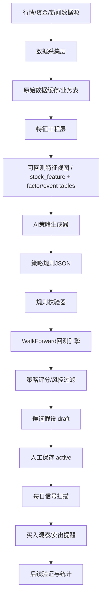

# AI预测工厂技术方案

更新时间：2026-07-09（架构评审修订版）

## 1. 背景与目标

AI预测工厂当前已经具备“AI生成量化假设 + 后端回测验证 + 保存有效假设 + 定时扫描信号”的雏形，但还没有充分利用项目里已有的数据能力。下一阶段目标不是把所有数据直接丢给 AI 猜涨跌，而是建立一套可复盘、可解释、可控风险的辅助决策系统。

核心目标：

1. 将 AI 的角色限定为“生成可执行策略假设”和“解释信号原因”。
2. 将程序的角色限定为“数据同步、特征计算、回测验证、信号扫描、风控提醒”。
3. 先做日线/分钟线级别的买卖提醒，不优先接 Tick/Level-2 高频数据。
4. 不做自动实盘下单，先做人工确认的辅助提醒。
5. 每个买入/卖出提醒都必须附带历史样本、胜率、回撤、止损、止盈和风险原因。
6. 每个策略和提醒都必须可复盘：当时可见的数据、规则版本、特征版本、回测配置都要能追溯。

非目标：

1. 不承诺盈利。
2. 不做满仓、加杠杆、自动追涨的交易系统。
3. 不把新闻、公告、研报直接当作买入理由。
4. 不在第一阶段接入 Tick 逐笔数据和高频交易逻辑。
5. 不输出“必买/包赚/确定上涨”这类投资承诺，只输出观察信号和风险边界。

## 2. 当前代码现状

### 2.1 前端入口

当前 AI预测工厂在研究中心中进入：

- `frontend/src/App.vue`：研究中心菜单入口。
- `frontend/src/components/researchIndex.vue`：渲染 `PredictionFactory`。
- `frontend/src/components/PredictionFactory.vue`：AI预测工厂主界面。

当前前端能力：

1. 加载 AI 配置：`GetAiConfigs()`。
2. 加载已保存假设：`GetMyPredictionHypotheses()`。
3. 同步特征数据：`SyncStockFeatures(stockScope)`。
4. 创建预测会话：`CreatePredictionSession(scene, stockScope, startDate, endDate, aiConfigId)`。
5. 保存假设为监控：`SavePredictionHypothesis(id)`。
6. 查看假设净值曲线：`GetPredictionHypothesisDailyNAV(id)`。

### 2.2 后端入口

Wails 暴露方法集中在 `app.go`：

- `CreatePredictionSession`
- `GetPredictionSession`
- `GetMyPredictionHypotheses`
- `SavePredictionHypothesis`
- `DisablePredictionHypothesis`
- `GetPredictionHypothesisStats`
- `GetPredictionHypothesisDailyNAV`
- `GetPredictionSignals`
- `SyncStockFeatures`

预测工厂核心后端在：

- `backend/backtest/api.go`
- `backend/backtest/ai_generator.go`
- `backend/backtest/engine.go`
- `backend/backtest/feature_engine.go`
- `backend/backtest/feature_sync.go`
- `backend/backtest/stock_pool.go`
- `backend/models/prediction_models.go`

### 2.3 当前 AI 交互方式

当前不是把全量行情直接丢给 AI。实际流程是：

```text
用户选择场景/股票池/回测区间/AI模型
        |
        v
后端检查 stock_feature 是否有历史特征
        |
        v
AI 生成 2-4 个策略规则 JSON
        |
        v
后端解析规则
        |
        v
WalkForwardValidator 用历史特征回测
        |
        v
保存通过验证的 hypothesis 为 draft
        |
        v
用户手动保存为 active
        |
        v
定时任务扫描每日信号并验证结果
```

AI 生成的是类似下面的规则：

```json
{
  "name": "放量趋势突破",
  "description": "短期均线强于中期均线且量能放大",
  "scene": "短线爆发",
  "timeHorizon": 5,
  "targetReturn": 0.05,
  "rule": {
    "entryConditions": [
      { "indicator": "MA5", "operator": ">", "ref": "MA20" },
      { "indicator": "VolumeRatio", "operator": ">", "value": 1.5 }
    ],
    "exitConditions": [
      { "indicator": "MA5", "operator": "<", "ref": "MA20" }
    ],
    "stopLoss": 0.07,
    "stopGain": 0.12,
    "maxHoldDays": 5,
    "maxHoldings": 5
  }
}
```

也就是说，AI 当前是“策略设计师”，不是“交易裁判”。裁判必须是后端回测和后续实盘跟踪验证。

### 2.4 当前数据能力

项目当前已经具备以下数据源或能力：

| 数据类型 | 当前代码位置 | 可用程度 | 适合用途 |
| --- | --- | --- | --- |
| 日K/分钟K | `backend/data/eastmoney_kline_api.go`、`sina_kline_api.go`、`tdx_kline_api.go` | 高 | 技术指标、回测、趋势判断 |
| 实时价格/五档盘口 | `backend/data/stock_data_api.go` | 中 | 到价提醒、止盈止损、盘中观察 |
| 股票基础池 | `StockBasic`、`AllStockInfo`、通达信同步 | 高 | 股票池、行业/概念过滤 |
| 板块资金流 | `backend/data/bk_fund_flow_api.go` | 中高 | 热门方向、行业强弱 |
| 概念资金流 | `backend/data/concept_fund_flow_api.go` | 中高 | 题材强弱、概念过滤 |
| 个股资金流 | `GetStockHistoryMoneyData`、`GetStockMoneyData` | 中 | 主力净流入、资金确认 |
| 市场情绪 | `backend/data/market_statistic_api.go` | 中 | 大盘环境过滤 |
| 股票异动 | `backend/data/stock_changes_api.go`、`stock_change_history_api.go` | 中 | 盘中异动提醒、短线情绪 |
| 新闻/公告/研报 | `backend/data/market_news_api.go`、`f10_data_api.go`、`iwencai_api.go` | 中 | 风险过滤、原因解释 |
| 持仓/交易日志 | `FollowedStock`、`TradingRecord` | 高 | 卖出提醒、频繁交易限制 |

本地库检查结果：

- `stock_feature`: 0 条。预测工厂要正常回测，必须先同步特征。
- `tushare_stock_basic`: 5911 条。
- `all_stock_info`: 5440 条。
- `bk_fund_flow`: 1024 条。
- `concept_fund_flow`: 992 条。
- `market_statistic`: 0 条。
- `stock_change_history`: 0 条。

## 3. 目标架构

推荐架构如下：



设计原则：

1. 数据先进库，再做特征，不让 AI 直接处理大量原始行情。
2. AI 只能输出受控 JSON，不允许输出自由格式交易建议。
3. 所有 AI 规则必须经过白名单校验、参数边界校验、历史回测。
4. 买入提醒和卖出提醒分离；卖出提醒优先级更高。
5. 每条信号都记录产生原因和后续验证结果。
6. 所有特征必须带 `data_as_of`，回测只能使用当时已经可见的数据。
7. 真实回测能力必须先于 active 监控上线，不能先保存偏乐观策略再后补修正。
8. AI 原始输出、模板兜底、规则校验失败原因都必须入库，避免“看起来成功但其实是兜底策略”。

## 4. 数据与特征层设计

### 4.1 当前主表

当前已经有 `stock_feature`：

```go
type StockFeature struct {
    StockCode    string
    Date         string
    Close        float64
    Open         float64
    High         float64
    Low          float64
    Volume       float64
    Turnover     float64
    MA5          float64
    MA10         float64
    MA20         float64
    MA60         float64
    MACD         float64
    RSI6         float64
    RSI12        float64
    KDJ_K        float64
    BOLLUpper    float64
    BOLLMid      float64
    BOLLLower    float64
    VolumeRatio  float64
    ATR          float64
    FundFlow5    float64
    FundFlow20   float64
    ChangeRate5  float64
    ChangeRate20 float64
}
```

建议保留 `stock_feature` 作为核心日线技术特征表，但不要把市场情绪、板块资金、异动事件、新闻公告全部直接塞进这张表。原因是这些数据频率不同、可见时间不同、缺失规律不同，混在单表里很容易在回测时产生未来函数或过期数据误用。

### 4.2 分层特征表设计

建议采用“原始业务表 -> 因子表/事件表 -> 可回测特征视图”的结构：

| 层级 | 表/视图 | 频率 | 用途 |
| --- | --- | --- | --- |
| 日线技术特征 | `stock_feature` | 日级 | OHLCV、均线、MACD、RSI、KDJ、BOLL、ATR、涨跌幅 |
| 市场环境 | `market_factor_daily` | 日级/收盘后 | 涨跌家数、涨跌停、市场情绪分、指数状态 |
| 板块/概念资金 | `sector_flow_daily`、`sector_flow_snapshot` | 日级/盘中快照 | 行业/概念资金强弱、排名、持续性 |
| 个股资金 | `stock_money_flow_daily` | 日级 | 主力净流入、资金流入占比、1/5/20 日统计 |
| 个股异动 | `stock_event_daily` | 日级汇总 | 涨停、跌停、急拉、急跌、大单买卖次数 |
| 风险事件 | `stock_risk_event` | 事件有效期 | 公告风险、新闻风险、ST、退市、停牌 |
| 回测特征 | `prediction_feature_view` 或物化表 | 按回测日期生成 | 将以上数据按 `trade_date` 和 `data_as_of` 做 as-of join |

第一阶段只建议给 `stock_feature` 补充元数据字段，不建议继续横向堆业务字段：

```go
DataAsOf       time.Time // 本行特征在什么时候可见
Source         string    // eastmoney/sina/tdx/manual
FeatureVersion string    // 特征计算版本
Adjusted       bool      // 是否复权
```

资金、情绪、异动、风险字段可以出现在 `prediction_feature_view` 中，作为回测和 AI 白名单指标使用，但物理存储应保留在各自因子表或事件表里。

说明：

1. 技术指标用于判断“形态”。
2. 资金流用于判断“有没有资金确认”。
3. 市场情绪用于判断“现在适不适合买”。
4. 新闻/公告只做风险过滤，不直接作为买入核心依据。
5. 回测只能读取 `signal_date` 当时已经可见的数据，不能读取未来才产生的字段。

### 4.3 特征同步策略

当前 `SyncStockFeatures(stockScope)` 会异步同步特征。建议改成可查询进度：

新增表：

```go
type FeatureSyncJob struct {
    ID           uint
    JobKey       string // task_type + stock_scope + date_range，做幂等
    StockScope   string
    StartDate    string
    EndDate      string
    Total        int
    Finished     int
    Failed       int
    Status       string // running/done/failed/canceled
    DataAsOf     time.Time
    CoverageJSON string
    RetryCount   int
    StartedAt    time.Time
    FinishedAt   *time.Time
    ErrorMessage string
}
```

新增接口：

```go
StartFeatureSync(stockScope string, days int) map[string]any
GetFeatureSyncJob(jobID uint) map[string]any
GetFeatureCoverage(stockScope string, startDate string, endDate string) map[string]any
```

前端在“生成 AI 预测”前必须检查覆盖率，覆盖率不能只看股票数量，要按股票、交易日、字段三维统计：

```text
可交易股票覆盖率 >= 95%
核心行情字段覆盖率 >= 98%
核心技术指标覆盖率 >= 95%
回测交易日覆盖率 >= 95%
可选资金/情绪/事件字段单独展示覆盖率，不达标时不能作为核心入场条件
剔除停牌、上市不足、退市、缺失严重股票时必须展示剔除原因
```

如果核心字段不达标，禁用生成按钮并提示先同步特征；如果只是可选字段不达标，可以允许生成基础技术策略，但前端必须明确标记“资金/情绪因子未参与”。

## 5. AI 交互设计

### 5.1 不直接丢全量数据给 AI

不推荐：

```text
把几千只股票的K线、资金流、新闻、公告全部塞给AI，让AI推荐股票
```

原因：

1. token 成本高。
2. AI 可能算错指标。
3. AI 输出不可复现。
4. 无法做严格回测。
5. 容易产生“看起来很有道理”的幻觉建议。

推荐：

```text
结构化特征入库
AI 只拿策略约束、市场摘要、可用字段说明
AI 输出可执行规则 JSON
程序回测和风控
AI 最后只负责解释结果
```

### 5.2 AI 输入内容

给 AI 的输入建议控制为：

1. 投资场景：短线爆发、波段反弹、趋势持有。
2. 股票池类型：全部A股、自选股、行业/概念、单只股票。
3. 市场摘要：市场强弱、涨跌停、板块资金排名。
4. 可用指标白名单。
5. 策略格式 JSON Schema。
6. 风控约束：最大持仓、止损范围、目标收益范围、最小交易次数。

### 5.3 AI 输出约束

AI 输出必须遵守固定 DSL，不能让模型自由发挥字段名和策略结构。建议所有策略 JSON 都带版本号：

```json
{
  "schemaVersion": "prediction-rule/v1",
  "name": "放量趋势突破",
  "scene": "短线爆发",
  "timeHorizon": 5,
  "targetReturn": 0.05,
  "risk": {
    "stopLoss": 0.07,
    "stopGain": 0.12,
    "maxHoldDays": 5,
    "maxHoldings": 5
  },
  "entry": {
    "all": [
      { "indicator": "MA5", "operator": ">", "ref": "MA20" },
      { "indicator": "VolumeRatio", "operator": ">", "value": 1.5 }
    ]
  },
  "exit": {
    "any": [
      { "indicator": "MA5", "operator": "<", "ref": "MA20" }
    ]
  }
}
```

后端必须强制校验：

1. `indicator` 必须在白名单内。
2. `operator` 必须是 `> >= < <= == !=`。
3. `value` 必须是合理数值。
4. `stopLoss` 建议限制在 `0.02 - 0.12`。
5. `stopGain` 建议限制在 `0.03 - 0.25`。
6. `timeHorizon` 建议限制在 `1 - 30`。
7. `targetReturn` 建议限制在 `0.01 - 0.20`。
8. 至少一个入场条件。
9. 不允许引用不存在字段。
10. 不允许输出“买入某某股票”这种非规则内容。
11. 必须声明 `schemaVersion`，不兼容版本直接拒绝。
12. 所有指标必须来自后端指标注册表，不能由 prompt 临时拼接。
13. AI 失败、JSON 解析失败、规则校验失败、模板兜底都必须记录到会话审计日志。

建议新增：

```go
func GetIndicatorRegistry() []IndicatorDefinition
func ValidatePredictionRule(ruleJSON string) (*Rule, []ValidationError)
func CompileRule(rule Rule) (*ExecutableRule, error)
func NormalizeHypothesis(h Hypothesis) Hypothesis
func RecordGenerationAudit(sessionID uint, source string, raw string, errors []ValidationError) error
```

规则验证失败时，前端不要只显示“生成失败”，要展示可理解的原因，例如：

```text
AI 输出引用了不可用指标 MainNetInflow20。
当前资金流覆盖率不足，不能作为入场条件。
已改用基础技术策略模板，结果仅供观察。
```

## 6. 回测引擎改造

当前回测引擎已经有 WalkForwardValidator，但还需要增强真实性。

### 6.1 防止未来函数

当前特征来自当日收盘后的数据，如果当日使用 `Close` 作为买入价格，容易产生“收盘后才知道信号，却按收盘价买入”的问题。

建议改为：

```text
T日收盘后生成信号
T+1日开盘价或均价买入
持有期间按日线检查止损/止盈/退出条件
```

对应改造：

```go
EntryMode string // next_open / next_close / signal_close_backtest_only
Slippage  float64
FeeRate   float64
```

默认：

```text
EntryMode = next_open
Slippage = 0.001 - 0.003
FeeRate = 0.0005 - 0.0015
```

这部分必须进入第一阶段。只有使用 `next_open` 或可解释的 T+1 成交近似，并扣除手续费和滑点后的回测结果，才允许保存为 active 监控。

建议新增回测配置：

```go
type BacktestConfig struct {
    EntryMode          string
    Slippage           float64
    FeeRate            float64
    UseLimitRule       bool
    UseSuspensionRule  bool
    MinDataCoverage    float64
    FeatureVersion     string
}
```

回测撮合必须处理：

1. T+1 开盘无法成交：涨停、停牌、缺少开盘价。
2. 止损/止盈触发顺序：日线只能近似，必须明确采用保守规则。
3. 单日多信号时的资金占用和最大持仓限制。
4. 交易成本、滑点、卖出税费。
5. 每笔交易的进入原因、退出原因、使用的数据版本。

### 6.2 回测统计指标

每个假设至少输出：

| 指标 | 说明 |
| --- | --- |
| TradeCount | 交易次数 |
| WinRate | 胜率 |
| AvgReturn | 平均收益 |
| MedianReturn | 中位收益 |
| ProfitLossRatio | 盈亏比 |
| MaxDrawdown | 最大回撤 |
| TotalReturn | 总收益 |
| AnnualizedReturn | 年化收益，仅作参考 |
| SharpeLike | 简化夏普 |
| AvgHoldDays | 平均持有天数 |
| MaxLossSingleTrade | 单笔最大亏损 |
| OutSampleAvgReturn | 样本外平均收益 |
| OutSampleMaxDrawdown | 样本外最大回撤 |
| DataCoverage | 回测特征覆盖率 |
| NoLookaheadPassed | 未来函数检查是否通过 |

策略进入“可保存”的最低要求建议：

```text
真实回测配置通过
NoLookaheadPassed = true
TradeCount >= 30
WinRate >= 0.48
AvgReturn > 0
MaxDrawdown <= 0.20
ProfitLossRatio >= 1.2
最近半年仍然有效
样本外 AvgReturn > 0
样本外 TradeCount >= 10
```

如果交易次数不足，前端应该显示：

```text
样本不足，仅供观察，不建议保存监控
```

### 6.3 样本内/样本外验证

不建议只做一次 70/30 切分。时间序列策略很容易刚好适配某一段行情，建议默认使用滚动 walk-forward：

```text
窗口1：前 12 个月筛选，后 3 个月验证
窗口2：向后滚动 3 个月
窗口3：继续滚动
最终统计所有样本外窗口
```

如果回测区间太短，可以退化为 70/30，但前端必须标记“验证强度较弱”。策略必须同时在样本外表现不崩：

```text
样本外 AvgReturn > 0
样本外 MaxDrawdown 可控
样本外 TradeCount >= 10
最近半年不失效
不同市场环境下不能只有单一牛市窗口有效
```

## 7. 买入提醒设计

买入提醒不要输出“必须买”，应该输出分级：

```text
观察
可小仓试探
等待回踩
不追高
风险过高
```

推荐评分模型先作为启发式排序，不要把它展示成“上涨概率”。权重必须配置化，后续用验证结果校准：

```text
SignalScore =
  规则匹配强度 * 0.25
+ 样本外质量分 * 0.30
+ 最近有效性分 * 0.20
+ 市场环境匹配分 * 0.15
+ 数据新鲜度分 * 0.10
- 风险扣分
```

评分展示建议：

```text
SignalScore 只代表观察优先级，不代表盈利概率。
低覆盖率、低样本量、数据过期时，必须降低等级或禁止输出“可小仓试探”。
```

前端展示：

```text
股票：xxx
状态：观察 / 条件满足-小仓观察 / 等回踩 / 不追高 / 风险过高
触发策略：放量趋势突破
信号日期：2026-07-09
数据截至：2026-07-09 18:30
建议观察价：xx.xx
不追高价：xx.xx
止损价：xx.xx
目标价：xx.xx
历史胜率：xx%
交易次数：xx
最大回撤：xx%
风险：市场偏弱 / 板块资金流出 / 有公告风险
```

## 8. 卖出提醒设计

卖出提醒优先级高于买入提醒。卖出提醒来源：

1. `FollowedStock` 中的成本价、止盈价、止损价。
2. `TradingRecord` 中的真实交易记录。
3. active 的预测假设退出条件。
4. 市场环境恶化。
5. 个股跌破关键均线或 ATR 风险阈值。

卖出提醒分级：

```text
继续持有
减仓
止盈
止损
策略失效
风险事件退出
```

建议新增接口：

```go
GetHoldingSellHints() []SellHint
GetStockTradeDecision(stockCode string) TradeDecision
```

建议模型：

```go
type TradeDecision struct {
    DecisionID      string
    StockCode       string
    StockName       string
    Action          string // observe / buy_watch / small_buy / hold / reduce / take_profit / stop_loss
    Score           float64
    ScoreType       string // heuristic / calibrated
    CurrentPrice    float64
    EntryPrice      float64
    StopLossPrice   float64
    TakeProfitPrice float64
    Reasons         []string
    Risks           []string
    StrategyID      uint
    StrategyVersion string
    FeatureVersion  string
    SignalDate      string
    DataAsOf        time.Time
    ValidUntil      time.Time
    MetricsSnapshot string // JSON: win rate, drawdown, out-sample metrics
    MatchedFacts    string // JSON: 本次触发用到的字段和值
    GeneratedAt     time.Time
}
```

每条提醒必须能回答：

1. 哪个策略触发。
2. 使用了哪一天、哪个版本的特征。
3. 哪些条件满足，哪些风险项扣分。
4. 历史样本内和样本外表现如何。
5. 这个提醒有效到什么时候，过期后不再展示为当前信号。

## 9. 定时任务设计

当前已有预测工厂定时任务类型：

- `prediction_sync_features`
- `prediction_scan_signals`
- `prediction_validate_signals`

当前代码现状：

```text
App.startup
  -> InitCronTasks()
  -> initPredictionCronTasks()
  -> 自动写入 cron_tasks
  -> 定时任务页面 GetCronTaskList() 读取 cron_tasks 全量列表
```

因此预测工厂任务展示到“定时任务”页面不是前端误显示，而是后端把它们作为普通 `CronTask` 自动注册到了通用任务表。这个设计复用了已有 cron 调度能力，但产品边界不清楚：用户任务、系统任务、模块内置任务混在一起，容易被误删、误改，也容易让用户误以为这是自己创建的任务。

收口原则：

1. 预测工厂任务属于系统内置任务，不属于普通用户任务。
2. 通用定时任务页面默认不展示系统任务，除非用户打开“显示系统任务”。
3. 系统任务只允许启用、禁用、立即执行、查看日志，不建议允许删除。
4. AI预测工厂页面自己展示同步特征、扫描信号、验证信号的状态和下次执行时间。
5. 启动初始化只负责补齐缺失系统任务，不应重复创建同类型任务。
6. 如果用户删除了系统任务，启动时可以恢复，但前端应该提示“系统任务将自动恢复”，不要表现成普通删除。

建议调整默认执行时间：

| 任务 | 当前/建议 | 说明 |
| --- | --- | --- |
| 特征同步 | 18:00 或 20:00 | 等行情和资金数据稳定后同步 |
| 信号扫描 | 20:30 | 收盘后生成次日观察信号 |
| 信号验证 | 16:30 | 验证到期信号，避免收盘数据未完整 |
| 市场情绪采集 | 交易日 9:30-15:00 每 5 分钟 | 用于盘中市场环境 |
| 板块/概念资金 | 交易时间每 60 秒 | 已有逻辑，可保留 |
| 股票异动保存 | 交易时间每 30-60 秒 | 用于盘中异动统计 |

定时任务必须补充幂等和新鲜度控制：

1. 使用交易日历判断是否交易日，不在非交易日生成新信号。
2. 每个任务用 `JobKey = task_type + trade_date + scope` 做唯一键，避免重复执行。
3. 任务开始时加锁，异常退出后允许超时恢复。
4. 信号扫描前检查核心数据 `data_as_of`，数据未完成时只生成“数据不足”状态，不生成交易提醒。
5. 对 `prediction_signal` 增加唯一约束：`hypothesis_id + stock_code + signal_date`。
6. 重试需要有上限和错误记录，不能无限后台循环。
7. 盘中快照只能用于盘中提醒，不能写入历史日线回测结果。

通用定时任务模块需要同时修正一个删除流程问题：当前删除逻辑如果先 `Delete` 再 `GetByID`，删除成功后会因为查不到记录返回失败文案。正确顺序应该是先查询任务，移除内存 cron entry，再删除数据库记录。

## 10. 前端页面改造

### 10.1 AI预测工厂

当前页面保留，增加：

1. 特征覆盖率卡片。
2. 同步任务进度条。
3. 生成前检查。
4. 策略质量标签。
5. 样本内/样本外分区展示。
6. 风险提示。
7. AI 输出来源标记：AI 生成 / 模板兜底 / 校验失败。
8. 回测配置展示：T+1、滑点、手续费、特征版本。
9. 数据时间提示：核心数据截至时间、可选因子覆盖率。

### 10.2 今日交易提醒

新增页面或 tab：

```text
今日买入观察
我的持仓卖出提醒
策略监控中
历史验证结果
```

### 10.3 单只股票决策面板

从自选股、K线页、AI预测工厂都可以进入：

```text
当前价格
趋势状态
资金状态
板块状态
市场环境
买入观察价
止损价
止盈价
策略解释
历史表现
数据截至时间
决策追踪ID
```

## 11. 后端接口清单

建议新增或增强：

```go
// 特征层
StartFeatureSync(stockScope string, days int) map[string]any
GetFeatureSyncJob(jobID uint) map[string]any
GetFeatureCoverage(stockScope string, startDate string, endDate string) map[string]any
GetFeatureFreshness(stockScope string) map[string]any
RebuildPredictionFeatureView(req FeatureViewRequest) map[string]any
RefreshMarketFactors(date string) string

// 策略层
GetIndicatorRegistry() []IndicatorDefinition
ValidatePredictionRule(ruleJSON string) map[string]any
CreatePredictionSessionV2(req PredictionSessionRequest) map[string]any
GetPredictionBacktestTrades(hypothesisID uint) []Trade
GetPredictionGenerationAudit(sessionID uint) []GenerationAudit

// 信号层
GetTodayPredictionSignals() []PredictionSignalView
GetHoldingSellHints() []TradeDecision
GetStockTradeDecision(stockCode string) TradeDecision
GetTradeDecisionTrace(decisionID string) TradeDecisionTrace
GetPredictionCronStatus() []SystemCronTaskStatus
RunPredictionCronTaskNow(taskType string) map[string]any
SetPredictionCronTaskEnabled(taskType string, enabled bool) string

// 风控层
GetRiskProfile(stockCode string) RiskProfile
GetPredictionFactoryDashboard() PredictionDashboard
GetTradingCalendar(startDate string, endDate string) []TradingDay
```

## 12. 数据库建议

### 12.1 保留当前表

- `prediction_session`
- `prediction_hypothesis`
- `prediction_signal`
- `prediction_hypothesis_daily`
- `stock_feature`
- `cron_tasks`

`cron_tasks` 建议增强系统任务字段：

```go
type CronTask struct {
    Module      string // prediction_factory / research / system / user
    IsSystem    bool   // 系统内置任务
    Visible     bool   // 是否默认显示在通用定时任务页
    AllowDelete bool   // 系统任务默认 false
    Owner       string // system/user
}
```

预测工厂三个默认任务建议入库为：

| TaskType | Module | IsSystem | Visible | AllowDelete |
| --- | --- | --- | --- | --- |
| `prediction_sync_features` | `prediction_factory` | true | false | false |
| `prediction_scan_signals` | `prediction_factory` | true | false | false |
| `prediction_validate_signals` | `prediction_factory` | true | false | false |

### 12.2 新增表

```go
type PredictionTrade struct {
    ID             uint
    HypothesisID   uint
    StockCode      string
    StockName      string
    SignalDate     string
    BuyDate        string
    SellDate       string
    BuyPrice       float64
    SellPrice      float64
    Fee            float64
    Slippage       float64
    ReturnRate     float64
    MaxReturn      float64
    MaxDrawdown    float64
    HoldDays       int
    EntryReasonJSON string
    ExitReason     string
    FeatureVersion string
    DataAsOf       time.Time
}
```

```go
type TradeDecisionLog struct {
    ID              uint
    DecisionID      string
    StockCode       string
    StockName       string
    Action          string
    Score           float64
    ScoreType       string
    CurrentPrice    float64
    ReasonsJSON     string
    RisksJSON       string
    MatchedFactsJSON string
    MetricsJSON     string
    StrategyID      uint
    StrategyVersion string
    FeatureVersion  string
    SignalDate      string
    DataAsOf        time.Time
    ValidUntil      time.Time
    CreatedAt       time.Time
}
```

```go
type FeatureSyncJob struct {
    ID           uint
    JobKey       string
    StockScope   string
    StartDate    string
    EndDate      string
    Total        int
    Finished     int
    Failed       int
    Status       string
    DataAsOf     time.Time
    CoverageJSON string
    ExcludedJSON string
    RetryCount   int
    StartedAt    time.Time
    FinishedAt   *time.Time
    ErrorMessage string
}
```

建议新增因子/审计表：

```go
type MarketFactorDaily struct {
    TradeDate      string
    DataAsOf       time.Time
    UpCount        int
    DownCount      int
    LimitUpCount   int
    LimitDownCount int
    SentimentScore float64
    Source         string
}

type StockMoneyFlowDaily struct {
    StockCode          string
    TradeDate          string
    DataAsOf           time.Time
    MainNetInflow1     float64
    MainNetInflow5     float64
    MainNetInflow20    float64
    MainNetInflowRatio float64
    Source             string
}

type SectorFlowDaily struct {
    SectorType  string // industry / concept
    SectorName  string
    TradeDate   string
    DataAsOf    time.Time
    NetInflow   float64
    Rank        int
    Source      string
}

type StockEventDaily struct {
    StockCode        string
    TradeDate        string
    DataAsOf         time.Time
    ChangeEventCount int
    HasLargeBuy      bool
    HasLargeSell     bool
    HasLimitUp       bool
    HasLimitDown     bool
    HasRapidRise     bool
    HasRapidFall     bool
    Source           string
}

type StockRiskEvent struct {
    StockCode   string
    RiskType    string // notice/news/st/suspend/delist
    Level       string // low/middle/high
    Reason      string
    ValidFrom   string
    ValidTo     string
    DataAsOf    time.Time
    Source      string
}

type PredictionGenerationAudit struct {
    ID           uint
    SessionID    uint
    Source       string // ai / template / validator
    RawOutput    string
    ErrorJSON    string
    SchemaVersion string
    CreatedAt    time.Time
}
```

关键索引和约束：

1. `stock_feature`: 唯一索引 `stock_code + date + feature_version`。
2. `prediction_signal`: 唯一索引 `hypothesis_id + stock_code + signal_date`。
3. `prediction_trade`: 索引 `hypothesis_id + stock_code + buy_date`。
4. `trade_decision_log`: 唯一索引 `decision_id`，普通索引 `stock_code + signal_date`。
5. `feature_sync_job`: 唯一索引 `job_key`。
6. 所有因子表至少有 `trade_date`、`data_as_of`、`source`，支持按 as-of 复盘。

## 13. 风控规则

系统默认风控：

1. 单日最多给出 1-3 只“可小仓试探”。
2. 市场情绪偏弱时，只给“观察”，不给“可小仓试探”。
3. 距离建议买入价超过 3% 时显示“不追高”。
4. 样本数不足 30 的策略不能进入 active。
5. 最大回撤超过 20% 的策略不能进入 active。
6. 单只股票 24 小时内不重复提示买入。
7. 已持仓股票优先显示卖出/持有建议，不重复提示买入。
8. 出现重大风险公告、ST、退市风险时直接拦截。
9. 未通过真实回测配置的策略不能进入 active。
10. 核心数据过期或覆盖率不足时，只能显示“数据不足”，不能显示买入观察。
11. 单个策略连续失效后自动降级为 paused，等待重新验证。
12. UI 文案统一使用“观察/提醒/风险边界”，避免“确定买入/确定卖出”的表达。

## 14. 分阶段落地计划

### 阶段一：可信跑通

目标：让当前 AI预测工厂稳定跑通，并确保回测结果不过度乐观。

任务：

1. 保证 `prediction_*` 表和 `stock_feature` 表自愈迁移。
2. 给 `stock_feature` 增加 `data_as_of`、`source`、`feature_version`。
3. 生成预测前检查三维覆盖率：股票、交易日、字段。
4. 同步特征数据时展示进度、失败明细和剔除原因。
5. AI 输出接入版本化 DSL、指标注册表、规则校验和生成审计。
6. 回测买入价格改成 T+1 开盘价或 T+1 VWAP 近似。
7. 回测加入手续费、滑点、涨跌停无法成交、停牌/缺失处理。
8. 保存每笔历史交易明细。
9. 增加样本外验证；样本不足或样本外不通过时不允许保存 active。
10. 将预测工厂默认 cron 任务标记为系统任务，通用定时任务页默认隐藏。
11. 修正定时任务删除流程：先取任务和移除内存调度，再删数据库。

验收：

```text
选择自选股或单只股票
同步特征数据
看到覆盖率和剔除原因
生成策略
看到 AI 输出来源、校验结果、真实回测配置
看到交易明细、样本内/样本外结果
只有通过真实回测和风控的策略才能保存为监控
次日可扫描信号，且信号带 data_as_of 和 decision_id
AI预测工厂页面能看到系统任务状态
通用定时任务页面默认不混入预测工厂系统任务
```

### 阶段二：数据特征治理

目标：把项目已有数据接入特征层，但不破坏数据时点边界。

任务：

1. 新增 `market_factor_daily`，接入市场情绪。
2. 新增 `sector_flow_daily/snapshot`，接入板块/概念资金。
3. 新增 `stock_money_flow_daily`，接入个股资金流 1/5/20 日统计。
4. 新增 `stock_event_daily`，接入股票异动日汇总。
5. 新增 `stock_risk_event`，接入公告/新闻/ST/停牌风险。
6. 构建 `prediction_feature_view`，统一做 as-of join。
7. 前端显示每个因子的覆盖率、来源和数据截至时间。

验收：

```text
AI可用指标列表中出现资金、情绪、异动、风险字段
每个指标都有 source、data_as_of、feature_version
后端可以用这些字段回测，且不会读取未来数据
前端可以显示信号由哪些因素触发
低覆盖率因子不会进入核心入场条件
```

### 阶段三：策略验证与评分校准

目标：减少过拟合，让策略评分更接近真实观察价值。

任务：

1. 实现滚动 walk-forward 验证。
2. 增加按市场环境分组的表现统计。
3. 增加策略衰减监控：最近一段失效自动降级。
4. 将 `SignalScore` 从固定权重改成可配置、可校准的启发式评分。
5. 建立策略看板：active、paused、failed、expired。
6. 记录每次信号后续表现，反向修正策略评分。

验收：

```text
同一策略可以看到多个样本外窗口表现
可以看到牛市/震荡/弱市下的表现差异
连续失效的策略会自动暂停
评分展示为观察优先级，而不是盈利概率
```

### 阶段四：交易提醒中心

目标：从“策略研究”升级为“每日辅助决策”。

任务：

1. 新增今日买入观察。
2. 新增我的持仓卖出提醒。
3. 接入 `FollowedStock` 成本价、止盈价、止损价。
4. 接入 `TradingRecord` 做真实持仓盈亏。
5. 增加 Windows/钉钉/飞书提醒。
6. 每个提醒提供 `decision_id`，可以打开完整追踪记录。

验收：

```text
每天收盘后给出次日观察清单
交易时段根据实时价格给出止盈止损提醒
每个提醒都有原因、风险、数据截至时间、有效期
已持仓股票优先展示卖出/持有提醒
```

### 阶段五：分钟线与盘口辅助

目标：优化买点，不做高频。

任务：

1. 引入 5分钟/15分钟 K 线。
2. 使用实时五档盘口判断是否追高。
3. 只用于执行辅助，不用于高频预测。
4. 不接自动下单。
5. 分钟线和盘口数据必须单独标记为盘中辅助，不写入日线历史回测结果。

验收：

```text
日线策略看好
分钟线确认回踩/突破
盘口不极端追高
系统给出“观察/等待/不追高”
盘中辅助信号和日线回测信号不会混淆
```

## 15. 测试与验收清单

必须补的测试：

1. 规则 DSL 单元测试：合法规则、非法指标、非法操作符、越界参数。
2. 特征 as-of join 测试：确保 T 日信号不能读取 T+1 数据。
3. 回测撮合测试：T+1 开盘、手续费、滑点、涨跌停、停牌、缺失数据。
4. 样本外验证测试：滚动窗口统计和样本不足拦截。
5. 定时任务幂等测试：重复运行不生成重复信号。
6. 数据覆盖率测试：字段缺失、股票缺失、交易日缺失都能正确提示。
7. 前端流程测试：同步特征、生成策略、查看回测、保存 active、查看信号追踪。
8. 系统任务隔离测试：预测工厂系统任务默认不出现在普通定时任务列表。
9. 定时任务删除测试：删除普通任务后前端返回成功，内存 cron entry 同步移除。

阶段一最低验收标准：

```text
go test ./backend/backtest ./backend/models
npm run build
AI预测工厂从空库启动不会再报 no such table
无核心特征时禁用生成按钮
生成后的策略必须能看到交易明细和真实回测配置
预测工厂三个系统任务不再默认污染通用定时任务列表
```

## 16. 推荐优先级

最高优先级：

1. 数据时点治理：`data_as_of`、`feature_version`、as-of join。
2. 回测真实性：T+1、滑点、手续费、涨跌停、停牌。
3. 规则 DSL、指标注册表、AI 生成审计。
4. 特征同步进度、覆盖率和剔除原因。
5. 保存交易明细和决策追踪。
6. 预测工厂系统任务与普通定时任务隔离。

中优先级：

1. 滚动样本外验证。
2. 卖出提醒。
3. 板块/概念资金接入。
4. 市场情绪接入。
5. 个股资金流接入。

低优先级：

1. Tick/Level-2。
2. 自动下单。
3. 复杂机器学习模型训练。
4. 大规模多因子优化。

## 17. 关键结论

当前代码已经不是单纯“把数据丢给 AI 猜股票”，而是有了量化策略工厂雏形：

```text
AI 生成策略
程序验证策略
用户保存策略
定时扫描信号
后续验证命中率
```

修订后的核心原则是：先让信号可信，再让信号丰富。下一阶段最重要的不是接更多更细的数据，而是把已有数据变成可回测、可解释、可风控、可复盘的结构化特征。对于小资金用户，先做日线/分钟线辅助决策、严格止损止盈、持仓卖出提醒，比 Tick 高频更务实。

## 18. v2 架构落地口径（2026-07）

### 18.1 策略不是参数组合

系统固定维护四个策略家族：双均线趋势、RSI 超卖反弹、布林突破、MACD 金叉。场景只实例化适用家族：

- 短线爆发：双均线、布林突破、MACD。
- 波段反弹：RSI 超卖反弹。
- 趋势持有：双均线、MACD。

持有期、止盈止损和阈值变化只进入参数稳定性压力测试，不作为独立策略落库，不参与重复投票。策略身份由可执行规则指纹确定，名称和展示参数不改变策略身份。

### 18.2 研究、验证和执行隔离

前 40% 交易日作为研究窗口，用于市场状态与 ResearchIdea 证据计算；后续时间窗口用于隔离重跑的时序验证。LLM 只能消费 ResearchIdea v2 和 active 指标，不能直接引用 candidate 数据。研究模板调用、模型配置、提示词、原始输出、规范化 DSL 和验证错误统一进入生成审计。

### 18.3 唯一执行入口

`strategy_v4 / quant-engine/v3` 的条件执行统一读取 UnifiedFeatureView。新规则使用 RuleEnvelopeV2：entry 交叉由 lag=1 与 lag=0 的两个 ALL 条件表达；exit 交叉必须显式携带 previousLeft/previousRight。旧规则继续兼容解析，但编译后按新语义执行。

### 18.4 裁决与生命周期

策略依次经过成本压力、参数扰动、时序样本外、基准超额和 ResearchIdea 稳定性检查。通过回测后只能进入 paper_trade。paper_trade 使用独立持久化模拟账户，保存现金、持仓、闭合交易和每日净值，复用回测的 OrderBuilder、FillSimulator、RiskEngine，并严格执行信号日收盘确认、下一交易日成交、T+1、涨跌停、费用与滑点。至少累计 60 个真实交易日、10 笔闭合交易、前向净值为正且样本外/回撤门槛通过后，仅标记为“可启用正式监控”，必须由用户确认才能进入 active，不自动晋级。前端展示交易日进度、账户权益、持仓、交易明细、净值/回撤曲线和未达标原因。active 默认 90 天复审，实际收益显著退化或市场状态与策略场景不匹配时退回 watch。

## 19. 五源机会发现与投资场景路由（2026-07）

股票推荐记录、异动监控、涨停梯队、形态选股和指标选股统一进入 `CandidateSnapshot`，不直接进入 DSL，也不能直接输出正式 BUY。每次快照保存来源级事实、原始记录哈希、事件时间、入库时间、`available_at`、`data_as_of`、特征版本、评分器版本、输入指纹和来源剔除诊断。五个原页面都提供“送入 AI 量化筛选”，预测工厂的“机会发现”页可配置来源并集、交集或最少来源共识，展示来源新鲜度、场景评分、理由、风险和观察计划。

形态选股与指标选股页面的原始查询、规范化查询、结果排名和每行原始 JSON 先固化为 `ScreeningExecutionSnapshot/Item`，再由候选池按 snapshot item 建立来源事实；自动任务使用的本地可复现筛选事实与页面来源快照保持分层。候选快照和涨停快照按规范化请求与来源内容哈希幂等，重复执行不生成重复版本；用户操作只会归档快照，候选项与来源事实不会物理删除。

场景路由保持四个策略家族，不把参数组合扩成八套策略：短线、波段、趋势候选进入既有四模板回测；长期配置在缺少历史时点基本面、估值、财务质量和盈利增长时明确标记为 `insufficient_data`，只允许观察。候选历史回测使用的是决策日股票池，存在事后选池偏差，因此只作诊断；裁决上限为 `paper_trade`，必须用不可变快照完成真实前向验证后才能启用正式监控。

候选会话持久化 `selectionAsOf` 和 `backtestDiagnosticOnly`。历史诊断区间不能晚于快照数据日，历史样本外与超额收益不参与正式晋级；正式监控资格只读取快照之后模拟账户的真实交易日、闭合交易、净值和回撤。早于 `CandidateSnapshot.available_at` 的 as-of 查询直接拒绝，不能把今天生成的快照伪装成历史可见。

交易日任务链为：15:10 技术特征、15:20 资金流、15:30 五源候选快照、15:35 信号刷新、16:00 前向验证。统一特征视图对事件、涨停、筛选和推荐事实执行 `available_at <= decision_as_of`，研究证据按日做横截面 IC/RankIC，避免把不同时点样本混在一起制造虚假显著性。
